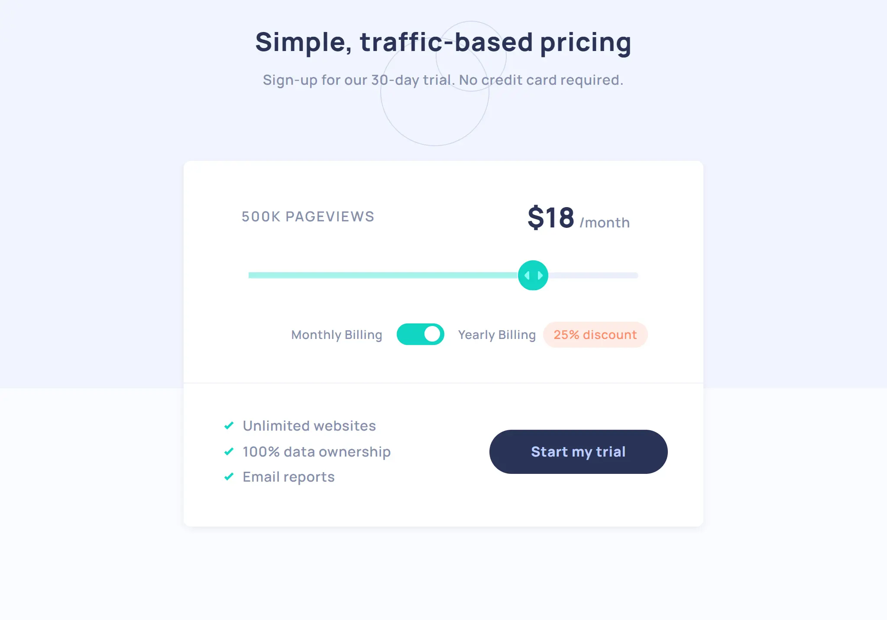
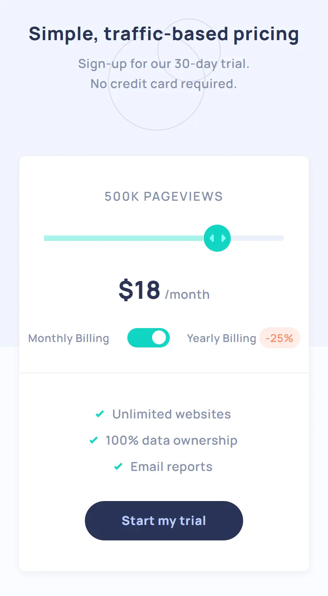

# Frontend Mentor - Interactive pricing component solution by Mirza

This is a solution to the [Interactive pricing component challenge on Frontend Mentor](https://www.frontendmentor.io/challenges/interactive-pricing-component-t0m8PIyY8).

## Table of contents

- [Screenshot](#screenshot)
- [What I've Learnt](#What-I've-Learnt)
- [Willing To Reach Advanced Goals](#Willing-To-Reach-Advanced-Goals)
- [Author](#author)
- [Date](#date)

## Screenshot

## What I've Learnt

- Use of Clip Path.
- Making of custom input.

## Willing To Reach Advanced Goals

- Clip Path

## Author

- Mirza Monirul Alam
- Frontend Mentor - [@WebDevMirza](https://www.frontendmentor.io/profile/WebDevMirza)

## Date

- 28 February 2023
